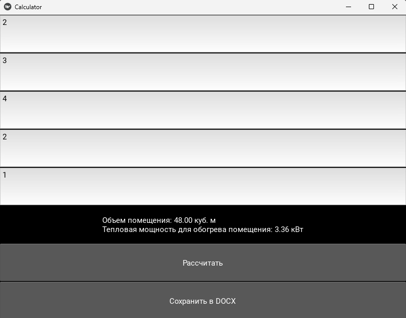

# lab13  

## Задание
Перепишите свой вариант лабораторной работы №12 с использованием классов и объектов.

Задание то же, вариант GUI фреймворка возьмите следующий по списку.

В коде должны присутствовать:
абстрактный базовый класс и соотвествующие декораторы для методов
 иерархия наследования
  managed - атрибуты
   минимум 2 dunder-метода у подклассов

## Проделанная работа
Проеделал всю ту же самую работу, что в `lab12`, но используя `Kivy` вместо `tkinter`

## Скриншоты

## Список использованных источников

[лаба](https://evil-teacher.on.fleek.co/prog_pm/term2/lab13/)
